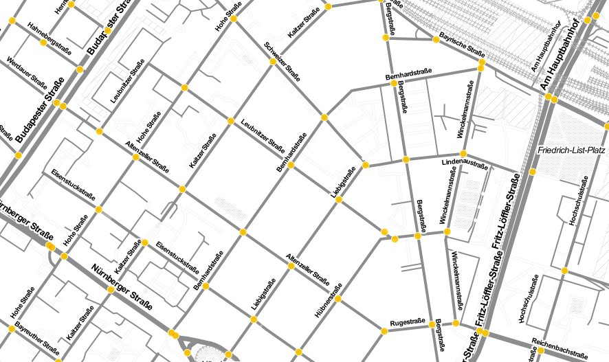

# OSM2Pandas
## Overpass-API to Pandas Dataframe

The [Overpass API](http://wiki.openstreetmap.org/wiki/Overpass_API) provides access to the data behind the Openstreetmap Data.
The [Overpass-Turbo](http://overpass-turbo.eu/) is the easiest way to test requests and get the correct code to ask the database.


Go from [this](http://overpass-turbo.eu/s/4h3) to this:

```
         lat        lon                          name wheelchair
0  50.984926  13.682178    Niederhäslich Bergmannsweg        NaN
1  51.123623  13.782789                  Sagarder Weg        yes
2  51.065752  13.895734       Weißig, Einkaufszentrum        NaN
3  51.007140  13.698498            Stuttgarter Straße        NaN
4  51.010199  13.701411            Heilbronner Straße    limited
5  51.003121  13.686136                Burgker Straße        NaN
6  50.996333  13.689492         Kleinnaundorf, Schule        NaN
7  51.087893  13.699240     Peschelstraße/Rankestraße         no
8  51.086979  13.639351                  Gohliser Weg        NaN
9  51.003893  13.626919  Freital Döhlen Daubenbergweg        NaN
```

and then to this:

[http://cdb.io/1n0VuOB](http://cdb.io/1n0VuOB)

### Video Tutorial

[https://vimeo.com/101220572](https://vimeo.com/101220572)

## Beispiele

### Kreuzungen in OSM finden

Annahme: Eine Kreuzung ist dadurch definiert, dass es einen `Node` gibt, der mindestens zu 2 verschiedenen `highways` gehört.

[IPython Notebook](http://nbviewer.ipython.org/github/balzer82/OSM2Pandas/blob/master/OSM2Pandas-Kreuzungen.ipynb)

<<<<<<< HEAD

=======
[Karte](http://cdb.io/1lmm93y)
>>>>>>> FETCH_HEAD
